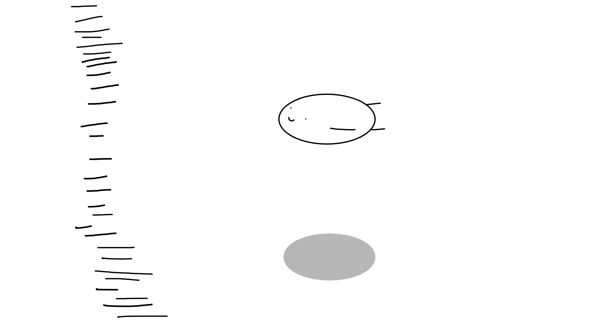

<body>
<h1 align="center"> ⬇️ 𝙒𝙚𝙡𝙘𝙤𝙢𝙚 𝙩𝙤 𝙢𝙮 𝙥𝙧𝙤𝙛𝙞𝙡𝙚 ⬇️ </h1>
 

 

<h2 align="center"> 💬 𝘼𝙗𝙤𝙪𝙩 𝙢𝙚 🗨️ </h2>

<li>
<b>Name:</b> Huy</li>
<li>
<b>Loves:</b> you! Whoever are reading this!
</li>
<li>
<b>Gender:</b> Male, or anyone prefers me as a Boy!
</li>
<li>
<b>Hobby:</b> Tech stuff, Animation, Web Development, Solve algorithm puzzle to some degree, Animes, Games
</li>
 

<b>     Thanks for reading about my personal stuff 
                                 💯❤️‍🔥</b>

<h2 align="left">            📇 𝙆𝙣𝙤𝙬𝙡𝙚𝙙𝙜𝙚/ 𝙆𝙣𝙤𝙬𝙣 𝙖𝙗𝙤𝙪𝙩 📇</h2>

    
     
 

 

I'm mostly work with 𝗖𝗦𝗦, 𝗛𝗧𝗠𝗟, 𝗝𝗮𝘃𝗮𝘀𝗰𝗿𝗶𝗽𝘁 and 𝗥𝗲𝗮𝗰𝘁𝗝𝗦 at the 𝗙𝗿𝗼𝗻𝘁-𝗲𝗻𝗱 and 𝗡𝗼𝗱𝗲.𝗝𝗦, 𝗘𝘅𝗽𝗿𝗲𝘀𝘀 at the 𝗕𝗮𝗰𝗸-𝗲𝗻𝗱 and deploy around 𝗛𝗲𝗿𝗼𝗸𝘂, 𝗡𝗲𝘁𝗹𝗶𝗳𝘆

 
<h2 align="center">⌨️ 𝙒𝙤𝙧𝙠 𝙀𝙭𝙥𝙚𝙧𝙞𝙚𝙣𝙘𝙚 🖱️</h2>

 
 
 
I used to take part as an <i><ins>Full-stack Web Developer Intern</ins></i> at <b><strong>SCC - Specialist Computer Centres</strong></b> in Internship Program from <i>HUTECH University</i>

 
<h2 align="right">📝 𝘾𝙤𝙣𝙩𝙖𝙘𝙩 𝙢𝙚 📝            </h2>

 

Here are some of my   
most used social info ヽ(o＾▽＾o)ノ

 

 

 
 
 
 
 
 
 
 

    <h2 align ="center">⚔️ 𝘾𝙝𝙖𝙧𝙖𝙘𝙩𝙚𝙧 𝙎𝙩𝙖𝙩 𝙇𝙀𝙑𝙀𝙇 𝙐𝙋! 🛡️</h2>
    
     
    
     
     
     
     
     
     
    

 
 
 
 
 
 
 
 
 
 
 
 
 
 
 

<h2 align="center">💖 𝙏𝙝𝙖𝙣𝙠𝙨 𝙛𝙤𝙧 𝙬𝙖𝙡𝙠𝙞𝙣𝙜 𝙩𝙝𝙧𝙤𝙪𝙜𝙝 𝙢𝙮 𝙥𝙧𝙤𝙛𝙞𝙡𝙚! 💖</h2>

</body>
